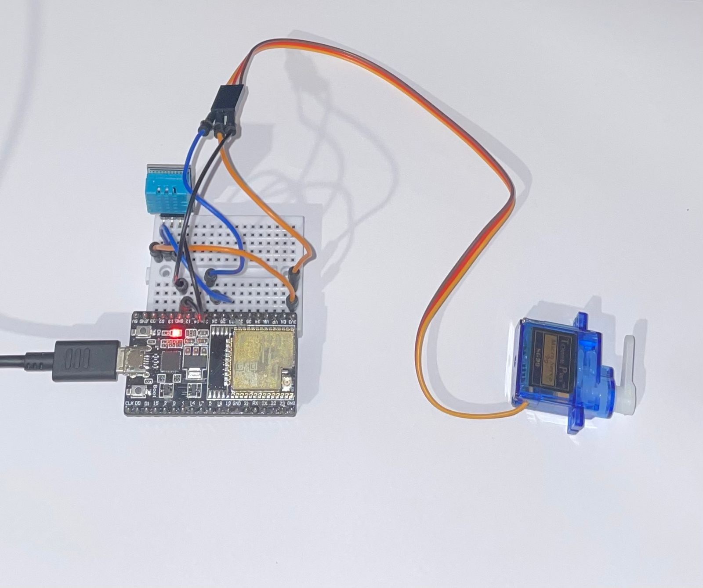
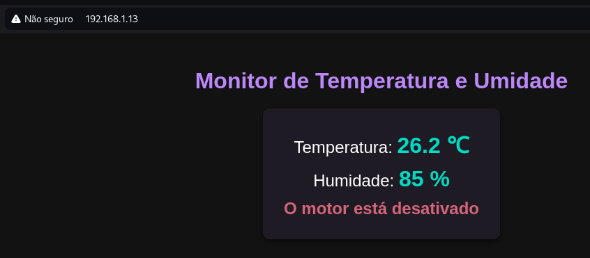

# Projeto: Monitor de Temperatura e Umidade com Servo Motor e Interface Web

Este projeto utiliza um ESP32, um sensor de temperatura e umidade DHT11, e um servo motor para criar um sistema que monitora em tempo real as condições ambientais e exibe essas informações em uma página web acessível via Wi-Fi. Além disso, o sistema possui um mecanismo para acionar o servo motor quando a temperatura ultrapassa um determinado limite, fazendo o motor oscilar entre duas posições (0° e 180°) e informando o estado do motor na interface web.

## Funcionalidades
- **Monitoramento de Temperatura e Umidade**: Leitura contínua dos valores do sensor DHT11.
- **Interface Web em Tempo Real**: Uma página web moderna com tema escuro que mostra a temperatura e a umidade em tempo real, além do estado do servo motor.
- **Acionamento do Servo Motor**: Quando a temperatura ultrapassa um valor limite (28°C por padrão), o servo motor começa a oscilar, e essa ação é refletida na página web.

## Componentes Utilizados
- **ESP32 (DOIT DEV KIT V1)**: Microcontrolador responsável por gerenciar o sensor, o servo motor e a página web.
- **Sensor DHT11**: Sensor responsável pela leitura da temperatura e umidade.
- **Servo Motor**: Motor controlado que oscila entre 0° e 180° quando a temperatura excede o limite.

## Esquemático

## Página Web

